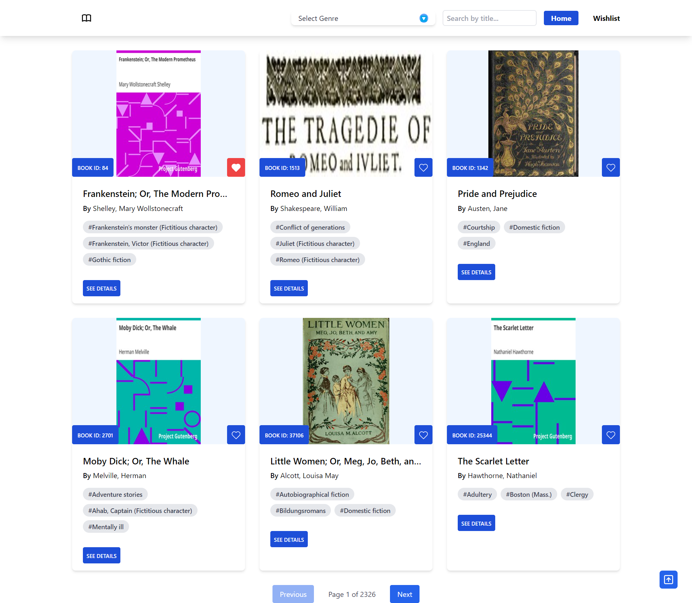
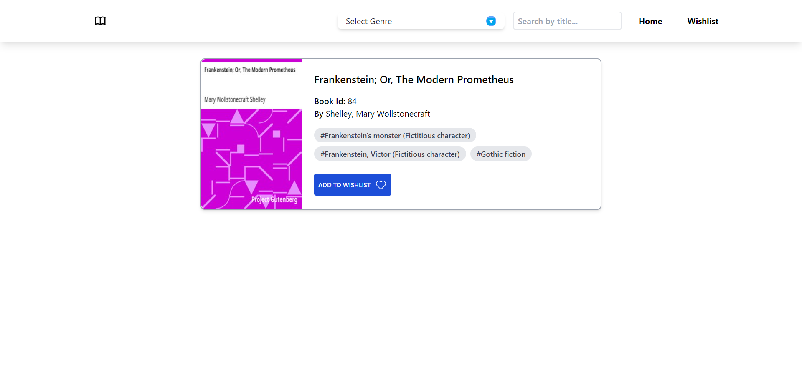
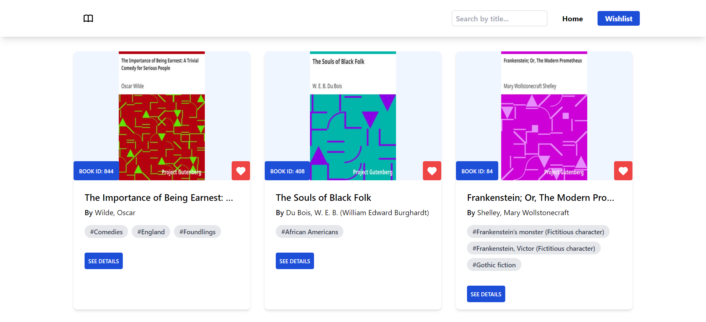

# Book Gallery

This project is a frontend web application that displays a list of books fetched from the [Gutendex API](https://gutendex.com/books). It allows users to search, filter, and paginate through the book list and manage a wishlist.

## Features

- **Book List**: Displays the title, author, cover image, genre, and ID of each book.
- **Search**: Real-time filtering of books based on the title.
- **Genre Filter**: A dropdown filter to show books by genre/topic.
- **Pagination**: Paginate the book list with next/previous and numbered page controls.
- **Wishlist**: Add/remove books to/from a wishlist. The wishlist is stored in localStorage and persists across page reloads.
- **Responsive Design**: Fully responsive layout that works well on both desktop and mobile devices.

## Pages

- **Homepage [/]**: Displays the paginated list of books with search and filter functionality.
- **Wishlist [/wishlist]**: Shows books added to the wishlist.
- **Book Detail Page [/book/:id]**: Displays detailed information about a selected book.

## Technologies Used

- HTML
- Tailwind CSS
- React Router Dom
- Gutendex Api

## Functionalities

### 1. Search

Real-time filtering was implemented using React Router's context, as it was already applied in the project, making it easier to manage state across components.  
**Challenge**:  
Deciding between state management methods like `useReducer`, `useContext`, or libraries like Redux. Eventually, I chose to use React Router's context for simplicity, as it already implemented.

### 2. Genre/Topic Filter

The selected genre is passed as a query parameter to the API to fetch filtered results. The API supports filtering via query parameters, which simplifies the process.  
**Challenge**:  
Accurate filtering was ensured by making API calls each time the selected genre changed.

### 3. Pagination

Pagination was handled on the server-side, as the API provided paginated results.

### 4. Wishlist using LocalStorage

Initially, I stored only the wishlist IDs and made API calls to retrieve the book data. However, to reduce API calls, I switched to storing the entire book data in localStorage. Optimizing localStorage usage to store book details instead of making redundant API requests.

### 6. Responsiveness

Tailwind CSS was used to create a responsive design efficiently.  
I considered using vanilla CSS to avoid additional dependencies, but Tailwind's flexibility made it a better choice for rapid development and responsiveness.

## How to Run

1. Clone the repository:

   ```bash
   git clone https://github.com/readwanmd/Book-Gallery.git
   ```

2. Navigate to the project directory:

   ```bash
   cd Book-Gallery
   ```

3. Install dependencies:

   ```bash
   npm i
   #or
   yarn
   ```

4. Run in local machine:

   ```bash
   npm run dev
   #or
   yarn dev
   ```

## Screenshots



<p align="center"><i>Home Page</i></p>



<p align="center"><i>Book Page</i></p>



<p align="center"><i>Wishlist Page</i></p>
